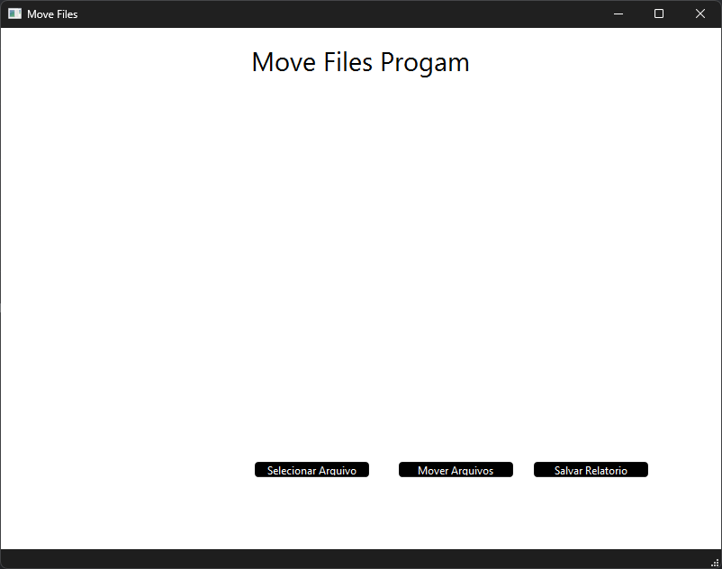
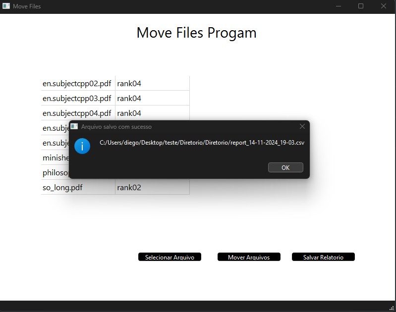
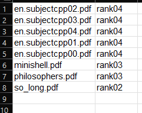
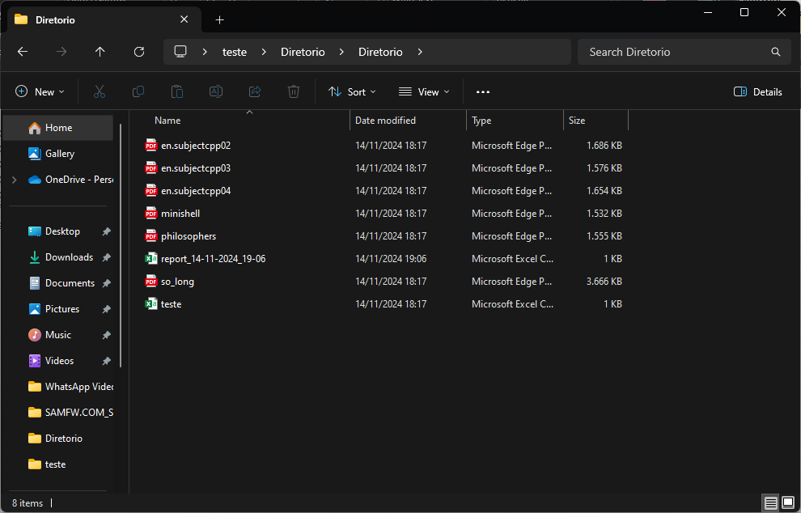

# Mv_File Windows

# Depedencies
# MinGw c++ installed 

Move file to another directory, this progam read a csv file and return csv with result
## How to work

The program was built with Qtcreator, so first thing you need to pass one file .csv where you need to have two columns, the first is the file with your extersion, the second column is name directory.
After this you need to pass where there are files to move,next the progam will create directory if not exist and move the file inside the directory, after the progam will give the result in csv, where the 
program moved your file or some error when tried to move.

## Main Screen

## File Selected

## PARSE CSV

## Result CSV

## DIR BEFORE

## DIR AFTER

## Final Considerations

It`s my first program I did make it to Windows if you find bug or some thing not correct, just send me email to fix, my email: diegoaguia31@gmail.com. My ideia when i make the program is automatize one job i did in my work, i belive its good small project i did do, because i used my knowledge with c/c++ and linux to make this, im happy to solve my problem .
